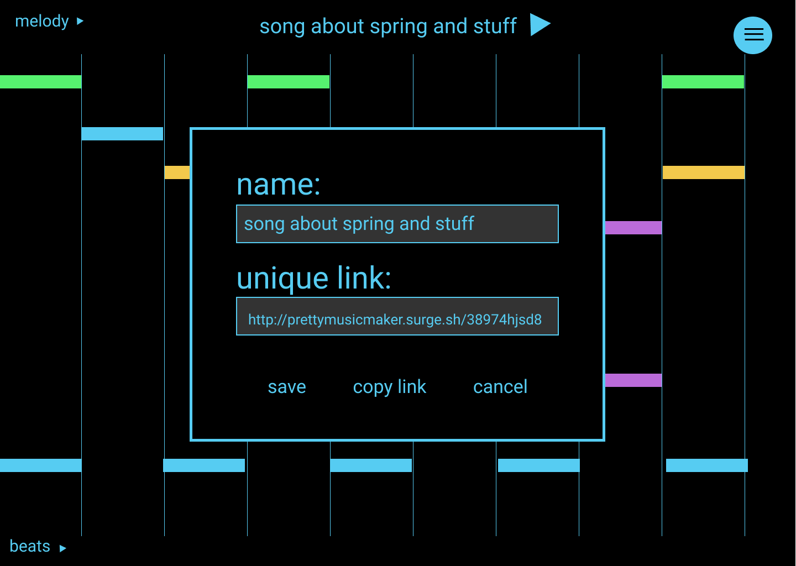

# Pretty Music Maker

Pretty Music Maker aims is to make producing music accessible and intuitive through a simple and easy to use UI. In essence, we are benchmarking [this app](https://musiclab.chromeexperiments.com/Melody-Maker) but we want to give more fine tune control to the users. Our app will be click driven in which users click to set events on a timeline that would continuously loop over from start to finish. Our app’s point of differentiation from the pre-existing counterparts are the ability to save music and share. If a user shares the unique song URL with a friend who also has an account, the friend can update the original song too and have collaborations.

## Mockup Designs




## Architecture

There are two components to this project:
* [Frontend](https://github.com/dartmouth-cs52-17S/project-client-prettymusicmaker)
* [Backend](https://github.com/dartmouth-cs52-17S/project-api-prettymusicmaker)

Tools and libraries: Redux (react-redux redux-thunk), React, Babel, Eslint, [tone.js](https://github.com/Tonejs/Tone.js/), Passport (passport-local and passport-jwt), JWT (jwt-simple), Bcryptjs, Mongoose

The Backend runs on [Heroku App server](https://prettymusicmaker.herokuapp.com) and uses mLab addon which is a sandbox for Mongodb. The Frontend uses react-redux. Reach the Backend by calling /api/music and /api/MUSIC_ID.

## Setup

Pull from the [client-prettymusicmaker](https://github.com/dartmouth-cs52-17S/project-client-prettymusicmaker) and [api-prettymusicmaker](https://github.com/dartmouth-cs52-17S/project-api-prettymusicmaker) repos into separate directories. Make sure you've installed the necessary libraries and tools outlined above. In each of the directories, do npm install and package.json should have all you need.


## Deployment

Use npm start to run each of the applications locally. Properly configure the Frontend to either use the local or the Heroku backend.


## AUTH & API endpoints

In order to authenticate users to the API, you will need to provide a token that includes information about the user, such as their id, email, etc. You should include the token in your requests whenever it is available, as it is the only way the API knows a user is logged in and can authorize requests to view, modify, or delete restricted content.

### Signup and Signin

```
# try to signup
curl -X POST -H "Content-Type: application/json" -d '{"email": "test@test.com","password": "password"}' "http://localhost:9090/api/signup"

# then try to signin
curl -X POST -H "Content-Type: application/json" -d '{"email": "test@test.com","password": "password"}' "http://localhost:9090/api/signin"
```

### Making an authenticated request

Include the user token in your header for every request you make; for instance, to make an authenticated request to music API endpoint, you might do

```
# authenticated request to an API endpoint
curl -H "Authorization: <TOKEN>" "http://127.0.0.1:9090/api/music"

# authenticated request to create a new music
curl -X POST -H "Content-Type: application/json" -H "Authorization: <TOKEN>" -d '{"title": "music1","author": "some Author","music": [[true,true],[false, true]]}' "http://localhost:9090/api/music"
```

### Endpoints that currently do not require authentication
```
# retrieve a specific music with <MUSIC_ID>
curl -X GET "http://localhost:9090/api/music/<MUSIC_ID>"

# delete a specific music with <MUSIC_ID>
curl -X DELETE -H "Content-Type: application/json" "http://localhost:9090/api/music/<MUSIC_ID>"
```

## Authors

SeokJun Bing,
Ke Deng,
Van Nguyen,
Ödön Örzsik,
Dylan Scandinaro

## Acknowledgments
* This project was inspired by [this app](https://musiclab.chromeexperiments.com/Melody-Maker).
* API side based on Jun's Lab 5 code
